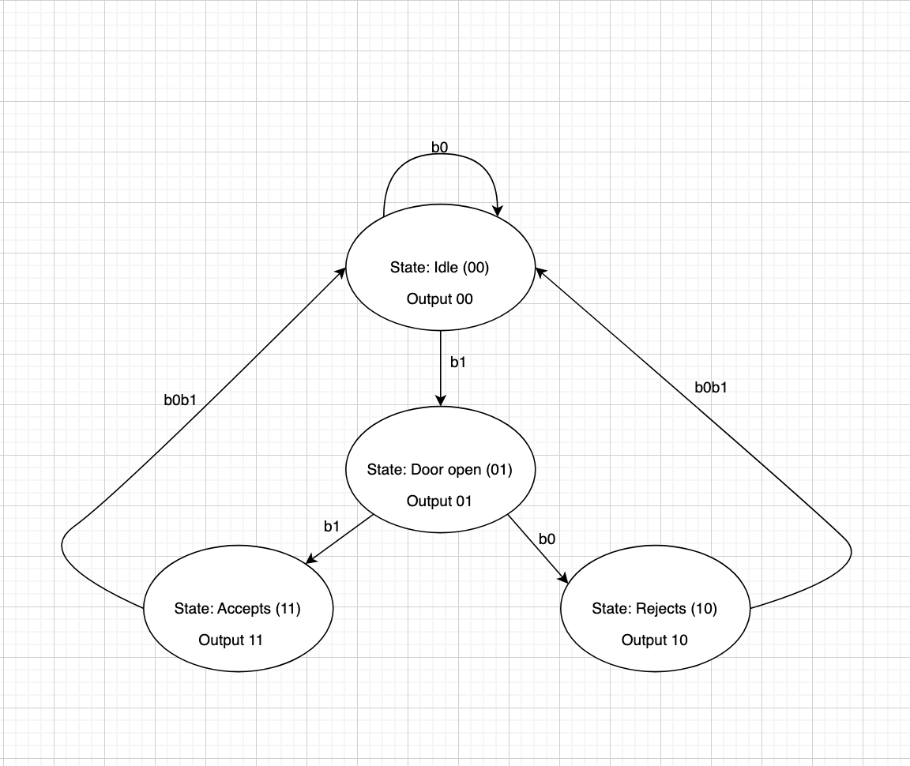
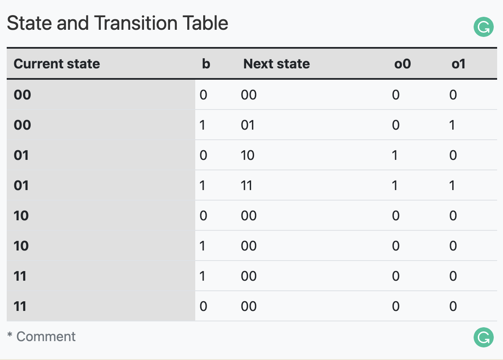
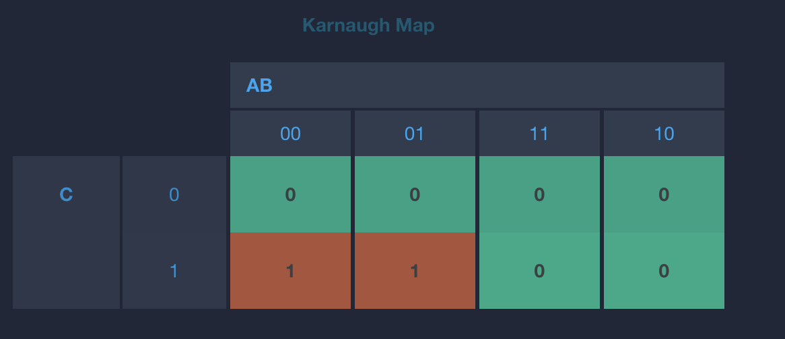
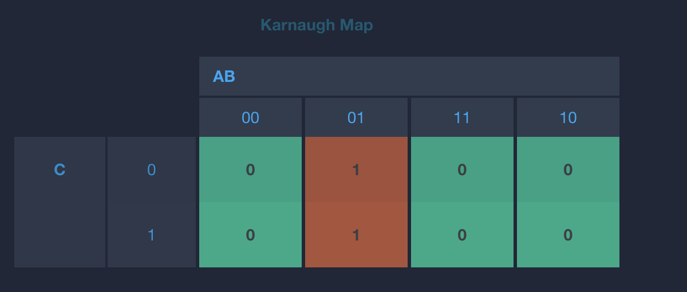
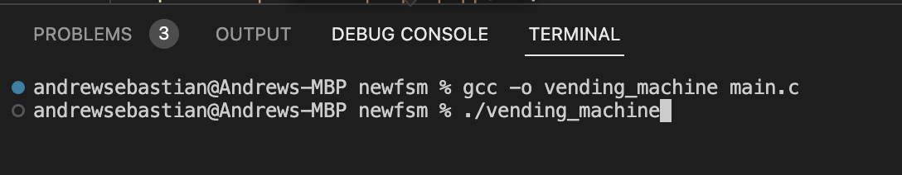
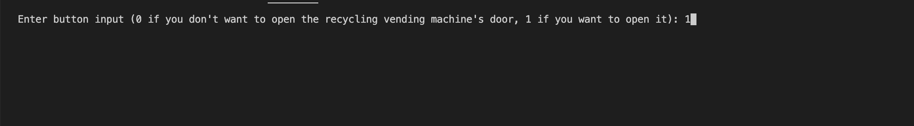
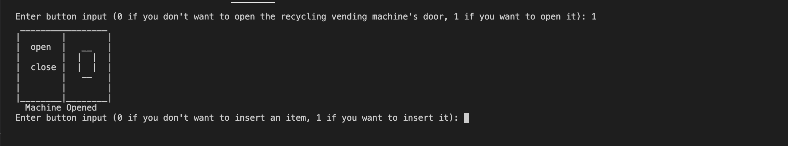
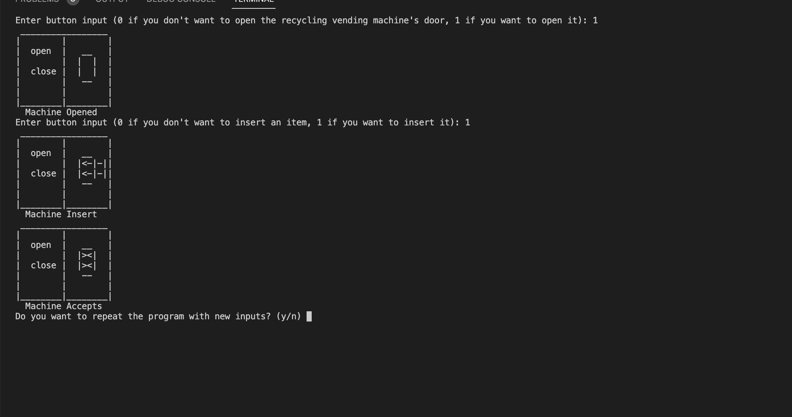
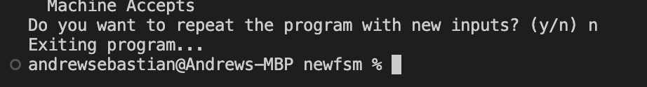
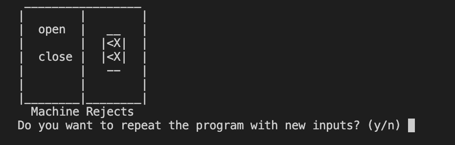

# [Scientific Computing] FSM - Virtual Final Project (Automatic Recycling Vending Machine)
## Andrew Sebastian Sibuea ID2602169711

Here is an example of a real system that can be modelled using an FSM:

**1. The system: Automatic Recycling Vending Machine** 

**2. Model:**

FSM:  
* States: Idle, Item selection, Payment, Dispensing.  
* Transitions:
1. Idle -> Item selection: When a customer selects an item
2. Item Selection -> Payment: When the customer confirms the selection and preceeds to Payment
3. Payment -> Dispensing: When the payment is accepted and verified 
4. Dispensing -> Idle: When the item is dispensing and the transaction is complete

### FSM Diagram: 

### State and Transition Table:

### Karnaugh Map
- ##### Next State (s0') Karnaugh Map

- ##### Next State (s1') Karnaugh Map

- ##### Output (o0) Karnaugh Map

- ##### Output (o1) Karnaugh Map

## 3. Derive combinatorial boolean equations from K-map
- #### Next State (s0) Karnaugh Map
s0' = s̅0b  
- #### Next State (s1) Karnaugh Map
s1' = s̅0s1
- #### Output(o0) Karnaugh Map
o0 = s̅0b  
- #### Output(o1) Karnaugh Map
o1 = s̅0s1

## 4. simulation in c:

I run the code using terminal and enter gcc -o vending_ machine main.c and . /vending machine

After successfully running the code, i typed 1 for the input to open the door of the automatic recycling vending machine.

Now that the door is open, i typed 1 again for the input to insert the item.

The item have been inserted and accepted by the machine.

And finally the machine will ask you to enter more items or to exit.

And if the item was rejected it ill ask you the same question again.

